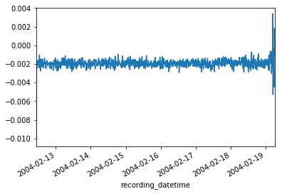
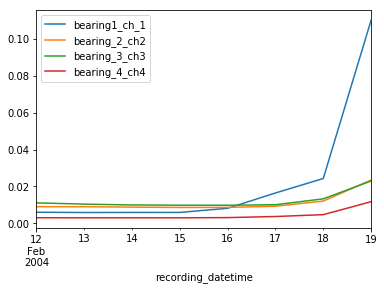
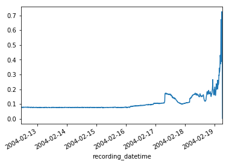
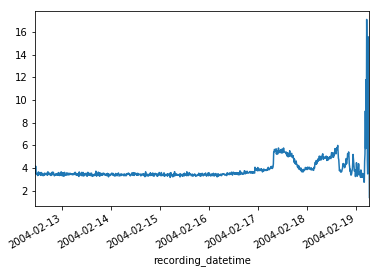
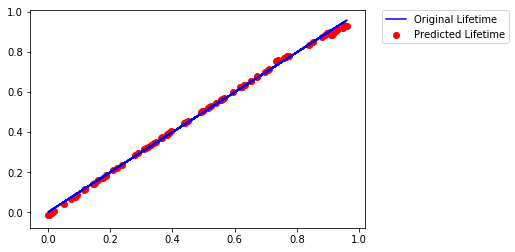
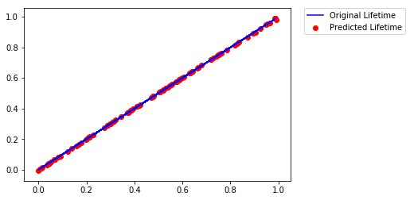

### Imports, read and setup dataset


```python
import pandas as pd
import glob
import matplotlib.pyplot as plt
import numpy as np
from scipy import stats
import datetime
from sklearn.neural_network import MLPRegressor
from sklearn.model_selection import train_test_split
from sklearn.metrics import mean_squared_error
from sklearn.preprocessing import MinMaxScaler

allFiles = glob.glob('2nd_test/*')
data = pd.DataFrame()
list_ = []

for f in allFiles:
    df = pd.read_csv(f, delim_whitespace=True, 
                 names=['bearing1_ch_1', 'bearing_2_ch2', 'bearing_3_ch3', 'bearing_4_ch4'])
    dt = pd.to_datetime(f.split('/')[1], format='%Y.%m.%d.%H.%M.%S')
    df['recording_datetime'] = dt
    df = df.set_index('recording_datetime')
    list_.append(df)

data = pd.concat(list_)
data = data.sort_index()

```

### Sample of dataset


```python
data.head(10)
```


<div>
<style>
    .dataframe thead tr:only-child th {
        text-align: right;
    }

    .dataframe thead th {
        text-align: left;
    }

    .dataframe tbody tr th {
        vertical-align: top;
    }
</style>
<table border="1" class="dataframe">
  <thead>
    <tr style="text-align: right;">
      <th></th>
      <th>bearing1_ch_1</th>
      <th>bearing_2_ch2</th>
      <th>bearing_3_ch3</th>
      <th>bearing_4_ch4</th>
    </tr>
    <tr>
      <th>recording_datetime</th>
      <th></th>
      <th></th>
      <th></th>
      <th></th>
    </tr>
  </thead>
  <tbody>
    <tr>
      <th>2004-02-12 10:32:39</th>
      <td>-0.049</td>
      <td>-0.071</td>
      <td>-0.132</td>
      <td>-0.010</td>
    </tr>
    <tr>
      <th>2004-02-12 10:32:39</th>
      <td>-0.042</td>
      <td>-0.073</td>
      <td>-0.007</td>
      <td>-0.105</td>
    </tr>
    <tr>
      <th>2004-02-12 10:32:39</th>
      <td>0.015</td>
      <td>0.000</td>
      <td>0.007</td>
      <td>0.000</td>
    </tr>
    <tr>
      <th>2004-02-12 10:32:39</th>
      <td>-0.051</td>
      <td>0.020</td>
      <td>-0.002</td>
      <td>0.100</td>
    </tr>
    <tr>
      <th>2004-02-12 10:32:39</th>
      <td>-0.107</td>
      <td>0.010</td>
      <td>0.127</td>
      <td>0.054</td>
    </tr>
    <tr>
      <th>2004-02-12 10:32:39</th>
      <td>-0.078</td>
      <td>-0.212</td>
      <td>0.042</td>
      <td>-0.044</td>
    </tr>
    <tr>
      <th>2004-02-12 10:32:39</th>
      <td>-0.020</td>
      <td>-0.010</td>
      <td>-0.144</td>
      <td>-0.007</td>
    </tr>
    <tr>
      <th>2004-02-12 10:32:39</th>
      <td>-0.046</td>
      <td>0.112</td>
      <td>0.034</td>
      <td>0.034</td>
    </tr>
    <tr>
      <th>2004-02-12 10:32:39</th>
      <td>-0.063</td>
      <td>-0.154</td>
      <td>0.071</td>
      <td>0.076</td>
    </tr>
    <tr>
      <th>2004-02-12 10:32:39</th>
      <td>0.068</td>
      <td>0.044</td>
      <td>-0.029</td>
      <td>0.054</td>
    </tr>
  </tbody>
</table>
</div>


### Exploring Results of Bearing 1


```python
data['bearing1_ch_1'].groupby('recording_datetime').mean().plot()
plt.show()
```





Clearly the vibrations show high variance towards end of life the bearing

### Plot of variance of the results from all bearings


```python
data.groupby(pd.TimeGrouper('D')).var().plot()
plt.show()
```





There is an obvious signature in the vibrations as a bearing approaches end of life

### Plotting RMS


```python
data_points = data['bearing1_ch_1'].groupby('recording_datetime')
K = data_points.count().values[0]
squared_sum = (data['bearing1_ch_1']**2).groupby('recording_datetime').sum()
rms = np.sqrt(squared_sum/K)
rms.plot()
plt.show()
```





### Plotting Kurtosis


```python
x_std = data_points.std()
subtr_mean_exp_4 = lambda x: (x - x.mean())**4
numer_non_summed = data_points.transform(subtr_mean_exp_4)
kurtosis_numerator = numer_non_summed.groupby('recording_datetime').sum()
kurtosis_denominator = (x_std**4)*(K-1)
kurtosis = kurtosis_numerator / kurtosis_denominator
kurtosis.plot()
plt.show()
```





### Weibull hazard rate parameter estimates


```python
def print_params(prefix, shape, loc, scale):
    prefix = str(prefix)
    print prefix.upper()
    print prefix+"_shape: " + str(shape) + " "+prefix+"_loc: " + str(loc) + " "+prefix+"_scale: " + str(scale)
    
kurt_shape, kurt_loc, kurt_scale = stats.weibull_min.fit(kurtosis)
print_params("kurtosis", kurt_shape, kurt_loc, kurt_scale)
rms_shape, rms_loc, rms_scale = stats.weibull_min.fit(rms)
print_params("rms", rms_shape, rms_loc, rms_scale)
```

    KURTOSIS
    kurtosis_shape: 2.315560958320515 kurtosis_loc: 1.3828140476279875 kurtosis_scale: 2.7194817355760743
    RMS
    rms_shape: 1.918676371496527 rms_loc: 0.0012512522563667486 rms_scale: 0.11833757316238475


### Calculate life percentage proportional to time - Output


```python
num_datapoints = kurtosis.count()
m = 1.0/num_datapoints
y = np.arange(984)*m #Life percentage is proportional to time
```

### Construct input to the NN


```python
# Calculate Hazard rate for RMS and Kurtosis
f_1 = rms.apply(lambda x: stats.weibull_min.pdf(x, rms_shape, rms_loc, rms_scale))
f_2 = kurtosis.apply(lambda x: stats.weibull_min.pdf(x, kurt_shape, kurt_loc, kurt_scale))
F_1 = rms.apply(lambda x: stats.weibull_min.cdf(x, rms_shape, rms_loc, rms_scale))
F_2 = kurtosis.apply(lambda x: stats.weibull_min.cdf(x, kurt_shape, kurt_loc, kurt_scale))

z_1_denom = (1-F_1.replace(1.000, 0.9999)) # Avoid inf values
z_1 = f_1 / z_1_denom

z_2_denom = (1-F_2.replace(1.000, 0.9999)) # Avoid inf values
z_2 = f_2 / z_2_denom

# Construct input
X = pd.DataFrame()
start_time = rms.index[0]
X['t_i_current'] = ((rms.index - start_time).total_seconds())/60
past_time_0 = 0.0
X['t_i_previous'] = pd.Series.append(pd.Series([past_time_0]), X['t_i_current'][0:-1]).reset_index()[0]
X['z_1_current'] = z_1.values
z_1_past_0 = pd.Series([0])
X['z_1_previous'] = pd.Series.append(z_1_past_0, X['z_1_current'][0:-1]).reset_index()[0]
X['z_2_current'] = z_2.values
X['z_2_previous'] = pd.Series.append(z_1_past_0, X['z_2_current'][0:-1]).reset_index()[0]

scaler = MinMaxScaler()
X = pd.DataFrame(scaler.fit_transform(X), columns=X.columns)
```

### Sample input set


```python
X.head(10)
```


<div>
<style>
    .dataframe thead tr:only-child th {
        text-align: right;
    }

    .dataframe thead th {
        text-align: left;
    }

    .dataframe tbody tr th {
        vertical-align: top;
    }
</style>
<table border="1" class="dataframe">
  <thead>
    <tr style="text-align: right;">
      <th></th>
      <th>t_i_current</th>
      <th>t_i_previous</th>
      <th>z_1_current</th>
      <th>z_1_previous</th>
      <th>z_2_current</th>
      <th>z_2_previous</th>
    </tr>
  </thead>
  <tbody>
    <tr>
      <th>0</th>
      <td>0.000000</td>
      <td>0.000000</td>
      <td>0.120857</td>
      <td>0.000000</td>
      <td>0.117812</td>
      <td>0.000000</td>
    </tr>
    <tr>
      <th>1</th>
      <td>0.001017</td>
      <td>0.000000</td>
      <td>0.122699</td>
      <td>0.121505</td>
      <td>0.119161</td>
      <td>0.117812</td>
    </tr>
    <tr>
      <th>2</th>
      <td>0.002035</td>
      <td>0.001018</td>
      <td>0.123995</td>
      <td>0.123346</td>
      <td>0.109921</td>
      <td>0.119161</td>
    </tr>
    <tr>
      <th>3</th>
      <td>0.003052</td>
      <td>0.002037</td>
      <td>0.127801</td>
      <td>0.124640</td>
      <td>0.155622</td>
      <td>0.109921</td>
    </tr>
    <tr>
      <th>4</th>
      <td>0.004069</td>
      <td>0.003055</td>
      <td>0.127421</td>
      <td>0.128444</td>
      <td>0.116049</td>
      <td>0.155622</td>
    </tr>
    <tr>
      <th>5</th>
      <td>0.005086</td>
      <td>0.004073</td>
      <td>0.127178</td>
      <td>0.128064</td>
      <td>0.106043</td>
      <td>0.116049</td>
    </tr>
    <tr>
      <th>6</th>
      <td>0.006104</td>
      <td>0.005092</td>
      <td>0.127662</td>
      <td>0.127821</td>
      <td>0.107561</td>
      <td>0.106043</td>
    </tr>
    <tr>
      <th>7</th>
      <td>0.007121</td>
      <td>0.006110</td>
      <td>0.126351</td>
      <td>0.128305</td>
      <td>0.107113</td>
      <td>0.107561</td>
    </tr>
    <tr>
      <th>8</th>
      <td>0.008138</td>
      <td>0.007128</td>
      <td>0.128267</td>
      <td>0.126995</td>
      <td>0.102586</td>
      <td>0.107113</td>
    </tr>
    <tr>
      <th>9</th>
      <td>0.009156</td>
      <td>0.008147</td>
      <td>0.123212</td>
      <td>0.128910</td>
      <td>0.097324</td>
      <td>0.102586</td>
    </tr>
  </tbody>
</table>
</div>


### Methods to train, predict, tune, plot


```python
def train_predict_plot(X_train, y_train, X_test, y_test, num_percep = 100, num_layers = 50, show_plot=True):
    training_model = MLPRegressor(
        activation='logistic', 
        hidden_layer_sizes=(num_percep, num_layers),
        learning_rate='adaptive',
        solver = 'lbfgs'
    )
    training_model.fit(X_train, y_train)
    predictions = training_model.predict(X_test)
    mse = mean_squared_error(y_val, predictions)
    if show_plot:
        plt.plot(X_test['t_i_current'], y_test, color='b', label='Original Lifetime')
        plt.scatter(X_test['t_i_current'], predictions, color='r', label='Predicted Lifetime')
        plt.legend(bbox_to_anchor=(1.05, 1), loc=2, borderaxespad=0.)
        plt.show()
    return [mse, training_model]

def plot_mse_vs_tuners(tuner, mse_df):
    num_tuner_vs_mse = mse_df[[tuner, 'MSE']].groupby(tuner).mean().reset_index()
    ax1 = num_tuner_vs_mse.plot.scatter(x=tuner, y='MSE')
    ax1.set_ylim(0.0, 0.00025)
    # mse_df.plot.scatter(x='num_perceptrons', y='MSE')
    plt.show()
    
def validate_with_diff_tuners(X_train, y_train, X_val, y_val, try_label, show_plot=True):
    mse = []
    for n_p in range(100, 1000, 100):
        for n_l in range(100, 1000, 100):
            res = {}
            res['try_label'] = try_label
            res['num_perceptrons'] = n_p
            res['num_layers'] = n_l
            res['MSE'], training_model = train_predict_plot(X_train, y_train, X_val, y_val, num_percep = n_p, num_layers = n_l, show_plot=False)
            mse.append(res)
    mse_df = pd.DataFrame.from_dict(mse)
    if show_plot:
        plot_mse_vs_tuners('num_layers', mse_df)
        plot_mse_vs_tuners('num_perceptrons', mse_df)
    return mse_df
```

### Find the right tuning parameters for the model (number of layers and perceptrons)


```python
mse_df = pd.DataFrame()
for i in range(1,11):
#     print "Try# " + str(i)
    X_train, X_val, y_train, y_val = train_test_split(X, y, test_size=0.2)
    res_df = validate_with_diff_tuners(X_train, y_train, X_val, y_val, 'try_'+str(i), show_plot=False)
    mse_df = pd.concat([mse_df, res_df])
```

Find the top 3 combinations in each try, i.e., 3 with least MSE in each try


```python
top_3 = pd.DataFrame()
for i in range(1,11):
    top_3 = pd.concat([top_3, mse_df[mse_df['try_label']=='try_'+str(i)].sort_values('MSE').head(3)])
```


```python
top_3['num_layers'].value_counts()
```


    900    7
    800    6
    500    5
    400    5
    700    3
    200    2
    100    1
    300    1
    Name: num_layers, dtype: int64


```python
top_3['num_perceptrons'].value_counts()
```


    100    15
    200     5
    300     4
    600     2
    900     2
    500     1
    400     1
    Name: num_perceptrons, dtype: int64


```python
top_3[top_3['num_perceptrons'] == 100]['num_layers'].value_counts()
```


    800    3
    900    3
    400    3
    700    2
    200    2
    500    2
    Name: num_layers, dtype: int64


#### Setting tuning parameters - part hunch, part data :)


```python
num_perceptrons = 100
num_layers = 800
```

#### Split Data into Train, Validation and Test


```python
X_train, X_test, y_train, y_test = train_test_split(X, y, test_size=0.1)
```


```python
X_train, X_val, y_train, y_val = train_test_split(X_train, y_train, test_size=0.1)
```

#### Train the model and predict on validation set


```python
train_mse, trained_model = train_predict_plot(X_train, y_train, X_val, y_val, num_percep = num_perceptrons, num_layers = num_layers, show_plot=True)
```





The validation seems pretty good!

#### Predict on test set


```python
# predictions = trained_model.predict(X_test)
# validation_mse = mean_squared_error(y_test, predictions)
plt.plot(X_test['t_i_current'], y_test, color='b', label='Original Lifetime')
plt.scatter(X_test['t_i_current'], predictions, color='r', label = 'Predicted Lifetime')
plt.legend(bbox_to_anchor=(1.05, 1), loc=2, borderaxespad=0.)
plt.show()
```





```python
print "Training Error: " + str(train_mse)
print "Validation Error: " + str(validation_mse)
```

    Training Error: 4.081554063315315e-06
    Validation Error: 4.96578390516976e-06

